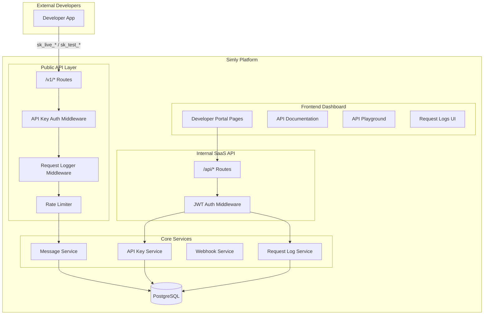

# Design Document - Developer API Portal

## Overview

Ce document décrit l'architecture et le design du portail développeur Simly, qui permet aux développeurs externes d'intégrer l'envoi de SMS via une API REST publique dédiée. Le système comprend :

1. **API Publique v1** (`/v1/*`) - Endpoints REST séparés des endpoints internes du SaaS
2. **Developer Portal** - Interface web pour la documentation, les tests et la gestion des intégrations
3. **Request Logging** - Système de journalisation des requêtes API pour le debugging
4. **Code Snippets Generator** - Génération d'exemples de code dans plusieurs langages

## Architecture



## Components and Interfaces

### 1. Public API Router (`/v1/*`)

Nouveau router dédié aux développeurs externes, séparé du router interne `/api/*`.

```go
// backend/internal/api/public_router.go

type PublicAPIRouter struct {
    messageService    *core.MessageService
    apiKeyService     *core.APIKeyService
    requestLogService *core.RequestLogService
}

// Routes:
// POST   /v1/messages          - Send SMS
// GET    /v1/messages/{id}     - Get message status
// GET    /v1/account           - Get account info (rate limits, usage)
```

### 2. API Key Authentication Middleware

Middleware spécifique pour l'API publique, acceptant uniquement les API keys.

```go
// backend/internal/api/public_auth_middleware.go

func PublicAPIAuthMiddleware(apiKeyService *core.APIKeyService) func(http.Handler) http.Handler {
    // Accepts only: Authorization: Bearer sk_live_* or sk_test_*
    // Sets context: org_id, app_id, is_sandbox
    // Rejects JWT tokens
}
```

### 3. Request Logger Middleware

Middleware pour journaliser toutes les requêtes API publiques.

```go
// backend/internal/api/request_logger_middleware.go

func RequestLoggerMiddleware(logService *core.RequestLogService) func(http.Handler) http.Handler {
    // Captures: method, path, status, duration, request_body, response_body
    // Stores in request_logs table
}
```

### 4. Request Log Service

Service pour gérer les logs de requêtes API.

```go
// backend/internal/core/request_log_service.go

type RequestLogService struct {
    store *store.Store
}

func (s *RequestLogService) CreateLog(ctx context.Context, log *model.RequestLog) error
func (s *RequestLogService) ListLogs(ctx context.Context, orgID int, filters RequestLogFilters) ([]model.RequestLog, error)
func (s *RequestLogService) GetLog(ctx context.Context, logID, orgID int) (*model.RequestLog, error)
```

### 5. Public Message Handler

Handler pour l'envoi de SMS via l'API publique avec format de réponse standardisé.

```go
// backend/internal/api/public_message_handler.go

type PublicMessageHandler struct {
    messageService *core.MessageService
    orgService     *core.OrganizationService
}

// POST /v1/messages
// Request:  { "to": "+33612345678", "body": "Hello!" }
// Response: { "id": "msg_xxx", "status": "pending", "to": "+33612345678", "created_at": "..." }

// GET /v1/messages/{id}
// Response: { "id": "msg_xxx", "status": "delivered", "to": "+33612345678", ... }
```

### 6. Standardized Error Response

Format d'erreur uniforme pour l'API publique.

```go
// backend/internal/api/public_errors.go

type APIError struct {
    Error struct {
        Code    string `json:"code"`
        Message string `json:"message"`
        Param   string `json:"param,omitempty"`
    } `json:"error"`
}

// Error codes:
// - invalid_request: Validation failed
// - invalid_api_key: Authentication failed
// - rate_limit_exceeded: Too many requests
// - resource_not_found: Message/resource not found
// - internal_error: Server error
```

### 7. Frontend Developer Portal Components

```typescript
// frontend/app/(protected)/developers/page.tsx - Main portal page
// frontend/app/(protected)/developers/docs/page.tsx - API documentation
// frontend/app/(protected)/developers/playground/page.tsx - API playground
// frontend/app/(protected)/developers/logs/page.tsx - Request logs

// Components:
// frontend/components/developers/api-docs.tsx
// frontend/components/developers/code-snippet.tsx
// frontend/components/developers/api-playground.tsx
// frontend/components/developers/request-logs-table.tsx
```

## Data Models

### Request Log Model

```go
// backend/internal/model/request_log.go

type RequestLog struct {
    ID             int       `json:"id"`
    OrganizationID int       `json:"organization_id"`
    ApplicationID  int       `json:"application_id"`
    APIKeyID       int       `json:"api_key_id"`
    Method         string    `json:"method"`
    Path           string    `json:"path"`
    StatusCode     int       `json:"status_code"`
    Duration       int       `json:"duration_ms"`
    RequestBody    string    `json:"request_body,omitempty"`
    ResponseBody   string    `json:"response_body,omitempty"`
    IPAddress      string    `json:"ip_address"`
    UserAgent      string    `json:"user_agent"`
    CreatedAt      time.Time `json:"created_at"`
}
```

### API Key Model Update

```go
// Existing model with new prefix format
type APIKey struct {
    // ... existing fields
    Prefix string // "sk_live_xxxx..." or "sk_test_xxxx..."
}

// Key generation:
// Production: sk_live_ + 32 random hex chars
// Sandbox:    sk_test_ + 32 random hex chars
```

### Public API Response Models

```go
// backend/internal/model/public_api.go

type PublicMessageRequest struct {
    To   string `json:"to" validate:"required,e164"`
    Body string `json:"body" validate:"required,max=1600"`
}

type PublicMessageResponse struct {
    ID        string    `json:"id"`
    Status    string    `json:"status"`
    To        string    `json:"to"`
    Body      string    `json:"body"`
    CreatedAt time.Time `json:"created_at"`
}
```

## Correctness Properties

*A property is a characteristic or behavior that should hold true across all valid executions of a system-essentially, a formal statement about what the system should do. 
Properties serve as the bridge between human-readable specifications and machine-verifiable correctness guarantees.*

Based on the prework analysis, the following correctness properties have been identified:

### Property 1: Code Snippet Language Coverage
*For any* API endpoint and *for any* supported programming language (cURL, JavaScript, Python, PHP, Go), the code snippet generator SHALL produce a valid, non-empty code example for that endpoint in that language.
**Validates: Requirements 1.3**

### Property 2: Error Response Display
*For any* failed API request in the playground, the Developer Portal SHALL display both the error code and a human-readable error message extracted from the response.
**Validates: Requirements 2.4**

### Property 3: Log Filtering Correctness
*For any* filter criteria (status code or endpoint path) applied to request logs, *all* returned log entries SHALL match the specified filter criteria.
**Validates: Requirements 3.3**

### Property 4: Request Logging Completeness
*For any* API request made with a valid API_Key to the Public API, a corresponding Request_Log entry SHALL exist with matching method, path, and status code.
**Validates: Requirements 3.4**

### Property 5: API Key Display Fields
*For any* API_Key displayed in the Developer Portal, the display SHALL include the key prefix, name, creation date, and last_used_at timestamp (or null indicator).
**Validates: Requirements 4.2**

### Property 6: API Key Revocation Effect
*For any* revoked API_Key, *all* subsequent requests using that key SHALL receive an HTTP 401 response with error code `invalid_api_key`.
**Validates: Requirements 4.3**

### Property 7: API Key Usage Timestamp Update
*For any* successful API request made with an API_Key, the key's last_used_at timestamp SHALL be updated to a value within 5 seconds of the request time.
**Validates: Requirements 4.4**

### Property 8: Webhook Display Fields
*For any* Webhook displayed in the Developer Portal, the display SHALL include the URL, event types, and a masked signing secret (showing only first/last characters).
**Validates: Requirements 5.2**

### Property 9: Webhook Dispatch on Status Change
*For any* message status change event, *all* webhooks matching the organization and event type SHALL receive a signed HTTP POST request containing the event payload.
**Validates: Requirements 5.4**

### Property 10: Code Snippet Key Insertion
*For any* Code_Snippet displayed with a selected API_Key, the snippet content SHALL contain the masked key prefix (e.g., `sk_live_xxxx...`).
**Validates: Requirements 6.3**

### Property 11: Public API Authentication Enforcement
*For any* request to the Public API (`/v1/*`) without a valid API_Key in the Authorization header, the system SHALL return HTTP 401 with error code `invalid_api_key`.
**Validates: Requirements 7.2**

### Property 12: Test Key Sandbox Mode
*For any* API request made with an API_Key starting with `sk_test_`, the system SHALL operate in Sandbox_Mode (no real SMS sent, simulated responses).
**Validates: Requirements 7.5**

### Property 13: Live Key Production Mode
*For any* API request made with an API_Key starting with `sk_live_`, the system SHALL route the message to a real connected device for delivery.
**Validates: Requirements 7.6**

### Property 14: Error Response Format Consistency
*For any* error response from the Public API, the response body SHALL be valid JSON containing an `error` object with `code` (string) and `message` (string) fields, and the HTTP status code SHALL match the error type (400 for validation, 401 for auth, 404 for not found, 429 for rate limit).
**Validates: Requirements 8.1, 8.2, 8.3, 8.4**

## Error Handling

### Public API Error Codes

| HTTP Status | Error Code | Description |
|-------------|------------|-------------|
| 400 | `invalid_request` | Request validation failed |
| 400 | `missing_parameter` | Required parameter missing |
| 401 | `invalid_api_key` | API key invalid or revoked |
| 403 | `insufficient_permissions` | Key doesn't have required permissions |
| 404 | `resource_not_found` | Requested resource doesn't exist |
| 429 | `rate_limit_exceeded` | Too many requests |
| 500 | `internal_error` | Server error |

### Error Response Format

```json
{
  "error": {
    "code": "invalid_request",
    "message": "The 'to' field must be a valid E.164 phone number",
    "param": "to"
  }
}
```

### Rate Limiting Headers

```
X-RateLimit-Limit: 100
X-RateLimit-Remaining: 95
X-RateLimit-Reset: 1640000000
Retry-After: 60  // Only on 429 responses
```

## Testing Strategy

### Unit Testing

Unit tests will cover:
- API key prefix parsing (`sk_live_*` vs `sk_test_*`)
- Error response formatting
- Code snippet generation for each language
- Request log filtering logic
- Webhook signature generation

### Property-Based Testing

Property-based tests will be implemented using Go's `testing/quick` package or `gopter` library for the backend, and `fast-check` for the frontend TypeScript code.

Each correctness property from the design document will be implemented as a property-based test:

1. **Property 1 (Code Snippet Coverage)**: Generate random endpoint/language combinations, verify non-empty output
2. **Property 3 (Log Filtering)**: Generate random logs and filters, verify all results match filter
3. **Property 6 (Key Revocation)**: Generate random keys, revoke them, verify all requests fail
4. **Property 11 (Auth Enforcement)**: Generate random requests without valid keys, verify 401 response
5. **Property 12 & 13 (Key Type Behavior)**: Generate random keys of each type, verify correct mode
6. **Property 14 (Error Format)**: Generate various error conditions, verify response format

### Integration Testing

Integration tests will verify:
- End-to-end message sending via Public API
- Webhook delivery on status changes
- Request logging pipeline
- Rate limiting behavior

### Test Configuration

- Property tests: Minimum 100 iterations per property
- Each property test will be tagged with: `**Feature: developer-api-portal, Property {number}: {property_text}**`
