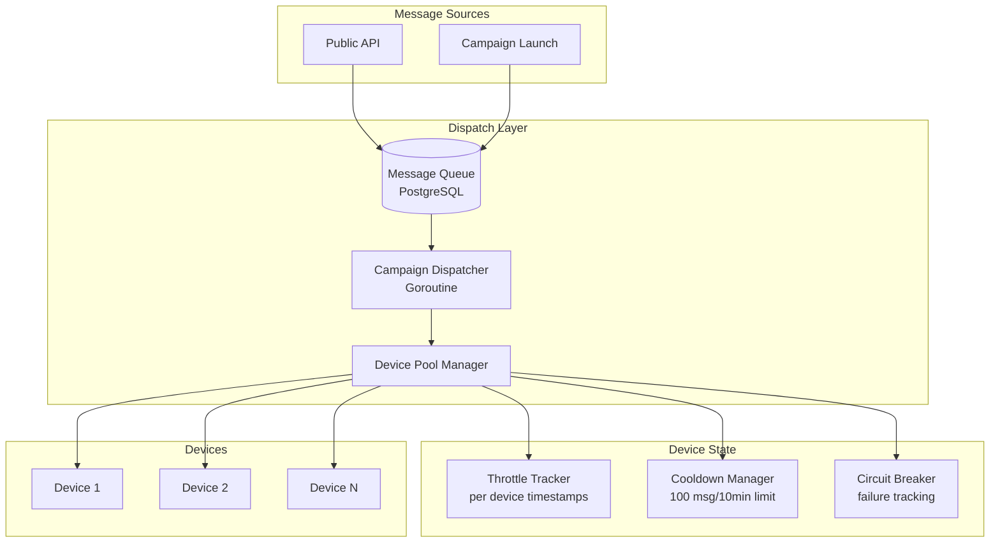

# Design Document: Intelligent SMS Dispatch System

## Overview

This design document describes the architecture for an intelligent SMS dispatch system that replaces the current naive loop-based campaign sending with a sophisticated queue-based dispatcher. The system implements per-device throttling, round-robin distribution across multiple devices, circuit breaker patterns for failure handling, and configurable send windows.

The core principle is to treat each device as a resource with limited capacity, managed through a centralized dispatcher that respects carrier limits while maximizing throughput across the device pool.

## Architecture



## Components and Interfaces

### 1. DispatcherService

The central orchestrator that processes pending messages from the queue.

```go
type DispatcherService struct {
    store           *store.Store
    messageService  *MessageService
    devicePool      *DevicePoolManager
    config          DispatchConfig
    running         bool
    mu              sync.Mutex
}

type DispatchConfig struct {
    BatchSize           int           // Messages to fetch per cycle (default: 50)
    TickInterval        time.Duration // How often to check for messages (default: 1s)
    DefaultThrottleRate time.Duration // Min delay between sends per device (default: 3s)
    DefaultSendWindowStart int        // Hour in 24h format (default: 8)
    DefaultSendWindowEnd   int        // Hour in 24h format (default: 21)
}

// Interface methods
func (d *DispatcherService) Start(ctx context.Context)
func (d *DispatcherService) Stop()
func (d *DispatcherService) ProcessBatch(ctx context.Context) error
func (d *DispatcherService) IsWithinSendWindow(orgID int) bool
```

### 2. DevicePoolManager

Manages device state, throttling, and selection.

```go
type DevicePoolManager struct {
    store          *store.Store
    throttleState  map[int]*DeviceThrottleState // key: deviceID
    circuitBreaker map[int]*CircuitBreakerState
    mu             sync.RWMutex
}

type DeviceThrottleState struct {
    LastSendTime    time.Time
    SendCount10Min  int       // Messages sent in last 10 minutes
    WindowStart     time.Time // Start of current 10-min window
    CooldownUntil   *time.Time
}

type CircuitBreakerState struct {
    ConsecutiveFailures int
    SuspendedUntil      *time.Time
    LastFailureTime     time.Time
}

// Interface methods
func (p *DevicePoolManager) GetNextAvailableDevice(ctx context.Context, orgID int, requiredTags []string) (*model.Device, error)
func (p *DevicePoolManager) RecordSend(deviceID int)
func (p *DevicePoolManager) RecordFailure(deviceID int) bool // returns true if circuit opened
func (p *DevicePoolManager) RecordSuccess(deviceID int)
func (p *DevicePoolManager) GetDeviceDelay(deviceID int) time.Duration
func (p *DevicePoolManager) IsDeviceAvailable(deviceID int) bool
```

### 3. SendWindowManager

Handles time-based send restrictions.

```go
type SendWindowManager struct {
    store *store.Store
}

type SendWindow struct {
    StartHour int    // 0-23
    EndHour   int    // 0-23
    Timezone  string // e.g., "Europe/Paris"
}

func (w *SendWindowManager) IsWithinWindow(orgID int, campaignID *int) bool
func (w *SendWindowManager) GetNextWindowOpen(orgID int, campaignID *int) time.Time
```

### 4. Updated CampaignService

Modified to use the dispatcher instead of direct sending.

```go
// LaunchCampaign now only creates messages and updates status
// The DispatcherService handles actual sending
func (s *CampaignService) LaunchCampaign(ctx context.Context, id, orgID int) error {
    // 1. Validate campaign
    // 2. Create messages in bulk with status "queued"
    // 3. Update campaign status to "processing"
    // 4. Return immediately - dispatcher picks up messages
}
```

## Data Models

### Organization Extensions

```sql
ALTER TABLE organizations ADD COLUMN IF NOT EXISTS sms_throttle_rate_seconds INTEGER DEFAULT 3;
ALTER TABLE organizations ADD COLUMN IF NOT EXISTS send_window_start INTEGER DEFAULT 8;
ALTER TABLE organizations ADD COLUMN IF NOT EXISTS send_window_end INTEGER DEFAULT 21;
ALTER TABLE organizations ADD COLUMN IF NOT EXISTS send_window_timezone VARCHAR(50) DEFAULT 'UTC';
```

```go
// Extended Organization model
type Organization struct {
    // ... existing fields ...
    SMSThrottleRateSeconds int    `json:"sms_throttle_rate_seconds"`
    SendWindowStart        int    `json:"send_window_start"`
    SendWindowEnd          int    `json:"send_window_end"`
    SendWindowTimezone     string `json:"send_window_timezone"`
}
```

### Campaign Extensions

```sql
ALTER TABLE campaigns ADD COLUMN IF NOT EXISTS send_window_start INTEGER;
ALTER TABLE campaigns ADD COLUMN IF NOT EXISTS send_window_end INTEGER;
ALTER TABLE campaigns ADD COLUMN IF NOT EXISTS pause_reason VARCHAR(50);
ALTER TABLE campaigns ADD COLUMN IF NOT EXISTS estimated_completion_at TIMESTAMP;
ALTER TABLE campaigns ADD COLUMN IF NOT EXISTS use_all_devices BOOLEAN DEFAULT false;
```

```go
// Extended Campaign model
type Campaign struct {
    // ... existing fields ...
    SendWindowStart       *int       `json:"send_window_start"`
    SendWindowEnd         *int       `json:"send_window_end"`
    PauseReason           *string    `json:"pause_reason"` // "cooldown", "circuit_breaker", "outside_window", "no_devices"
    EstimatedCompletionAt *time.Time `json:"estimated_completion_at"`
    UseAllDevices         bool       `json:"use_all_devices"`
}

// New request field
type CreateCampaignRequest struct {
    // ... existing fields ...
    SendWindowStart *int  `json:"send_window_start"`
    SendWindowEnd   *int  `json:"send_window_end"`
    UseAllDevices   bool  `json:"use_all_devices"` // If true, distribute across all devices
}
```

### Message Status Extension

```go
// New message statuses
const (
    MessageStatusQueued    = "queued"    // In dispatch queue, not yet assigned to device
    MessageStatusPending   = "pending"   // Assigned to device, awaiting send
    MessageStatusSent      = "sent"      // Sent by device
    MessageStatusDelivered = "delivered" // Delivery confirmed
    MessageStatusFailed    = "failed"    // Terminal failure
)
```

## Correctness Properties

*A property is a characteristic or behavior that should hold true across all valid executions of a system-essentially, a formal statement about what the system should do. Properties serve as the bridge between human-readable specifications and machine-verifiable correctness guarantees.*

### Property 1: Throttle rate enforcement
*For any* device and any sequence of messages sent through that device, the time between consecutive sends SHALL be at least the configured Throttle_Rate (default 3 seconds).
**Validates: Requirements 1.1, 1.4**

### Property 2: Cooldown trigger consistency
*For any* device that has sent 100 messages within a 10-minute window, the device SHALL be marked as in cooldown and no messages SHALL be dispatched to it until the cooldown period expires.
**Validates: Requirements 1.2**

### Property 3: Round-robin distribution fairness
*For any* campaign with N available devices and M messages where M > N, after processing all messages, the difference in message count between any two devices SHALL be at most 1.
**Validates: Requirements 2.1**

### Property 4: Circuit breaker activation
*For any* device that experiences 5 consecutive failures, the circuit breaker SHALL suspend that device, and no messages SHALL be dispatched to it until the suspension period expires.
**Validates: Requirements 3.1, 3.2**

### Property 5: Circuit breaker reset on success
*For any* device that successfully sends a message after circuit breaker recovery, the consecutive failure counter SHALL be reset to zero.
**Validates: Requirements 3.4**

### Property 6: Send window enforcement
*For any* message processed by the dispatcher, if the current time is outside the configured Send_Window, the message SHALL remain in queued status and not be dispatched.
**Validates: Requirements 4.1, 4.2**

### Property 7: Campaign completion detection
*For any* campaign where all messages have reached a terminal status (sent, delivered, or failed), the campaign status SHALL be updated to "completed" within 30 seconds.
**Validates: Requirements 5.3**

## Error Handling

### Device Offline During Campaign
1. Dispatcher detects device offline via status check
2. Messages assigned to offline device are reassigned (DeviceID set to NULL)
3. Next dispatch cycle picks them up and assigns to available device
4. Campaign continues without interruption

### All Devices Unavailable
1. Dispatcher detects no available devices (all offline, cooldown, or circuit-broken)
2. Campaign status updated to "processing" with PauseReason = "no_devices"
3. Alert sent to organization
4. Dispatcher continues checking every tick interval
5. When device becomes available, processing resumes automatically

### Circuit Breaker Recovery
1. After suspension period, device enters "half-open" state
2. Single test message dispatched
3. On success: circuit closes, normal operation resumes
4. On failure: circuit reopens for another suspension period

### Database Connection Loss
1. Dispatcher catches DB errors
2. Logs error and continues to next tick
3. No messages lost (still in queue)
4. Automatic retry on next cycle

## Testing Strategy

### Unit Testing
- Test DevicePoolManager throttle calculations
- Test CircuitBreakerState transitions
- Test SendWindowManager time calculations
- Test round-robin device selection logic

### Property-Based Testing

We will use `gopter` (Go Property Testing) library for property-based tests.

Each property test will:
1. Generate random inputs (devices, messages, timestamps)
2. Execute the system under test
3. Verify the property holds

**Test Configuration:**
- Minimum 100 iterations per property
- Tests tagged with property reference: `// **Feature: intelligent-sms-dispatch, Property N: description**`

**Property Tests to Implement:**
1. Throttle enforcement: Generate random send sequences, verify minimum delay
2. Cooldown trigger: Generate 100+ sends in 10-min window, verify cooldown activates
3. Round-robin fairness: Generate N devices and M messages, verify distribution
4. Circuit breaker: Generate failure sequences, verify suspension
5. Send window: Generate timestamps inside/outside window, verify dispatch behavior

### Integration Testing
- End-to-end campaign launch with multiple mock devices
- Verify message distribution across devices
- Verify campaign completion detection
